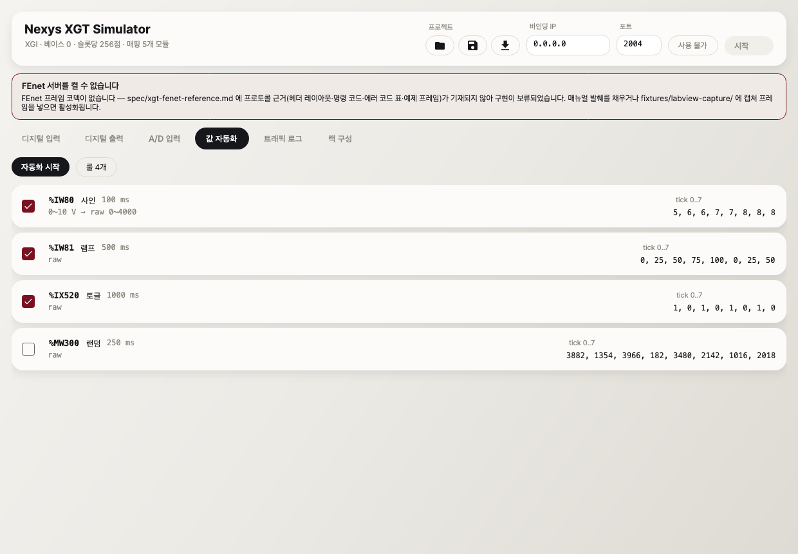
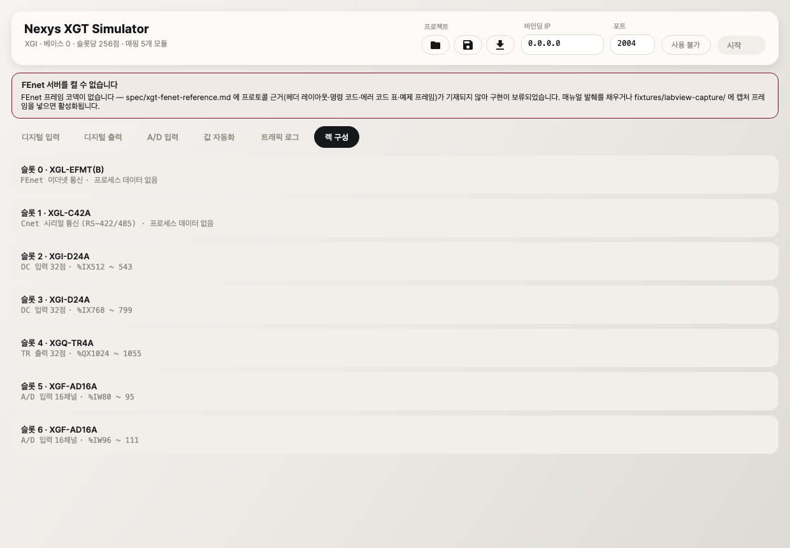

# Nexys XGT Simulator (nxsim)

LS XGT PLC(XGI CPU) 시뮬레이터. 실장비 없이 **LabVIEW 애플리케이션을 검증**하기 위해 PLC 역할을 대신한다.
XG5000은 실장비 없이 시뮬레이션이 불가능하므로 그 공백을 메운다.

C# 12 / .NET 8 · Avalonia 11 · 테스트 239개 · 빌드 경고 0


---

## ⚠️ 먼저 읽을 것 — 지금은 LabVIEW가 접속할 수 없다

**XGT FEnet 프레임 코덱이 구현되지 않아 서버를 켤 수 없다.** 프로토콜 근거가 저장소에 없기 때문이다.

`spec/xgt-fenet-reference.md` 는 아직 "채울 내용" 목차만 있고 6개 항목이 모두 비어 있다 —
헤더 레이아웃 / 명령 코드·데이터 타입 코드 표 / 변수명 표기 규칙 / 에러 상태 코드 표 / 예제 프레임 / 기본 포트.

이 프로젝트는 **프레임 구조를 기억이나 추측으로 구현하는 것을 금지한다**(`CLAUDE.md` §3, 조작 제로 원칙).
그럴듯하지만 틀린 프레임은 "LabVIEW가 실장비와 구분 못 할 것"이라는 목표를 정면으로 배반하고,
LabVIEW 쪽 버그를 시뮬레이터 버그로 오진하게 만든다. 그래서 **비워 두었고, 앱이 그 사실을 화면에 표시한다.**

> 게이트는 **서버에만** 걸려 있다. 랙 패널·값 자동화·프로젝트 파일은 지금도 전부 동작한다.

### 게이트를 푸는 방법

**A. 매뉴얼 발췌 (권장)** — `spec/xgt-fenet-reference.md` 의 6개 항목을 XGT FEnet I/F 사용설명서에서 발췌(출처 페이지 명기).

**B. LabVIEW 캡처 (장비 불필요 · 30분)** — 완성된 LabVIEW 코드는 **이미 정답 요청 프레임을 생성한다.**

```bash
# 1. 더미 리스너를 띄운다 (LabVIEW가 실장비에 접속할 때 쓰는 포트로)
nc -l 2004 > fixtures/labview-capture/req_read.bin

# 2. LabVIEW 앱의 대상 IP를 127.0.0.1 로 바꾸고 읽기 동작을 수행한다
# 3. 동작별로 파일을 나눠 모은다 (req_read.bin, req_write.bin, ...)
# 4. 각 요청의 기대 응답을 매뉴얼과 대조해 같은 이름 .expected 로 작성한다
```

> ⚠️ `.expected` 에 시뮬레이터 출력을 복사하면 안 된다. 회귀가 자기 자신을 검증하는 셈이 되어 무의미해진다.

`.bin` 을 넣으면 회귀 스위트가 **자동 편입**되고, 코덱이 아직 없으면
"캡처는 있지만 코덱이 없다"고 **실패로 알린다**(조용히 통과하지 않는다).

### 근거가 도착한 뒤 할 일

`IFrameCodec` 구현체 **한 개**만 추가하면 된다. 서버·프레이밍 상태머신·요청 실행기·메모리·UI·자동화는
모두 프로토콜을 모르게 만들어 두었으므로 손댈 필요가 없다.

1. `src/Nxs.Core/Protocol/IFrameCodec.cs` 구현 — 헤더 레이아웃·명령 코드·에러 코드 매핑·Invoke ID 에코를 그 안에
2. 프레임 경계 규칙은 `IFrameLengthRule` 로 함께 구현
3. `src/Nxs.App/App.axaml.cs` 에서 `MainWindowViewModel` 생성 시 `codecFactory` 로 넘긴다
4. `tests/.../LabViewCaptureRegressionTests.XgtCodecFactory` 에 연결 → 캡처 회귀가 살아난다

---

## 설치와 실행

### Windows — 실행 파일 다운로드

[**릴리즈 페이지에서 `Nxs.App.exe` 받기**](../../releases) — 맨 위가 최신이다

단일 파일 self-contained 빌드다(약 97 MB). **.NET 런타임 설치가 필요 없다.** 받아서 더블클릭하면 된다.

- SmartScreen 경고가 뜨면 `추가 정보` → `실행` (코드 서명 인증서 없음)
- 릴리즈 페이지의 `SHA256SUMS.txt` 로 무결성을 확인할 수 있다
- ⚠️ 현재 빌드는 **macOS 에서 크로스 컴파일**되었고 Windows 실제 기동은 검증되지 않았다.
  첫 실행 시 [`SMOKE_CHECKLIST.md`](SMOKE_CHECKLIST.md) 0~2장으로 확인해 주기 바란다

### 소스에서 실행 (Windows / macOS / Linux)

```bash
dotnet run --project src/Nxs.App
```

---

## 사용법 체크리스트

### 처음 켤 때 (5분)

- [ ] `Nxs.App.exe` 실행 — 설치 과정 없이 창이 뜬다
- [ ] 상단 **⛔ 배너**를 확인한다 (현재는 FEnet 코덱 부재 안내가 뜬다)
- [ ] **"랙 구성"** 탭에서 슬롯별 할당 주소가 XG5000 I/O 파라미터와 일치하는지 대조한다
      → 다르면 `.nxp` 의 `addressing.slotPoints` 를 실제 값으로 맞춘다
- [ ] **"디지털 입력"** 탭에서 점 하나를 토글해 본다 (즉시 메모리에 반영된다)
- [ ] **"A/D 입력"** 탭 채널에 값을 넣어 raw 변환이 맞는지 확인한다

### LabVIEW를 붙일 때 (코덱 필요)

- [ ] **바인딩 IP** 를 정한다 — 다른 PC에서 접속하려면 `0.0.0.0`
      (⚠️ `127.0.0.1` 로 두면 다른 PC에서 접속 불가 — 접속 실패의 가장 흔한 원인)
- [ ] **포트** 를 실장비와 동일하게 맞춘다
- [ ] Windows 방화벽에서 해당 포트 인바운드 허용
- [ ] **[시작]** → 상태 필이 와인레드 `수신 중 <IP:포트> · 접속 0` 으로 바뀐다
- [ ] LabVIEW에서 연결 → 접속 수가 **1** 로 증가, "트래픽 로그"에 RX 행이 뜬다
- [ ] 입력 점 토글 → LabVIEW 화면에 반영되는지 확인 (**읽기** 경로)
- [ ] LabVIEW에서 출력 ON → "디지털 출력" LED가 켜지는지 확인 (**쓰기** 경로)
- [ ] 범위 밖 주소를 읽어 오류 응답을 받고도 **연결이 유지되는지** 확인

전체 절차와 증상별 원인 표는 **[`LABVIEW_CHECKLIST.md`](LABVIEW_CHECKLIST.md)** 에 있다.
배포 전 스모크 항목은 **[`SMOKE_CHECKLIST.md`](SMOKE_CHECKLIST.md)**.

### 매일 쓸 때

- [ ] **[📂]** 프로젝트 열기 → 저장해 둔 랙 구성·초기값·자동화 룰 복원
- [ ] **[💾]** 프로젝트 저장 → 현재 토글 상태와 AD 값이 초기값으로 저장된다
- [ ] **[⬇]** 트래픽 로그 저장 → 검증 근거를 파일로 남긴다
- [ ] "값 자동화" 탭 **[자동화 시작]** → 룰이 값을 자동으로 흔든다
- [ ] 트래픽이 많으면 "오류만" 체크로 거절 사례만 본다

---

## 화면

### 디지털 출력 — 마스터가 쓴 값을 LED로 표시

사용자가 클릭해도 바뀌지 않는다. LabVIEW가 쓴 값만 반영한다.


### A/D 입력 — 공학단위 ↔ raw 자동 변환

한쪽에 입력하면 반대쪽이 채널 스케일에 따라 자동 변환된다 (아래는 0–10 V ↔ raw 0–4000).


### 값 자동화 — tick 순수 함수 제너레이터

각 룰은 개별 on/off 가능하고, `tick 0..7` 미리보기로 값이 어떻게 움직일지 미리 확인할 수 있다.



### 트래픽 로그 — raw hex + 해석 요약

RX/TX 쌍, 거절 사유, 타임스탬프가 함께 남는다. 오류 행만 필터할 수 있다.

> 아래 화면은 **테스트 하네스의 합성 코덱**으로 실제 왕복을 발생시켜 찍은 것이다.
> 표시된 hex 는 그 합성 포맷이며 **XGT 프레임이 아니다**(XGT 코덱은 ⛔ 미구현).
> 로그 렌더링·해석 요약·오류 표시가 어떻게 보이는지를 나타낸다.


### 랙 구성 — 슬롯별 장착 모듈과 할당 주소



---

## 대상 랙 구성

`CONTEXT.md` 기재 구성(XG5000 I/O 파라미터 기준).

| 슬롯 | 모듈 | 할당 주소 |
|---|---|---|
| 0 | XGL-EFMT(B) FEnet | (프로세스 데이터 없음) |
| 1 | XGL-C42A Cnet | (프로세스 데이터 없음) |
| 2 | XGI-D24A DC입력 32점 | `%IX512` ~ `%IX543` |
| 3 | XGI-D24A DC입력 32점 | `%IX768` ~ `%IX799` |
| 4 | XGQ-TR4A TR출력 32점 | `%QX1024` ~ `%QX1055` |
| 5 | XGF-AD16A A/D 16채널 | `%IW80` ~ `%IW95` |
| 6 | XGF-AD16A A/D 16채널 | `%IW96` ~ `%IW111` |

> **⚠️ 이 주소는 슬롯당 256점(16워드) 스트라이드 가정에서 나온 값이다.**
> `spec/xgi-addressing.md` 가 비어 있어 실제 XGI 슬롯 할당 규칙이 확정되지 않았다.
> XGF-AD16A는 16워드(256비트)를 쓰므로 기본 가정 64점에는 담기지 않아 256점을 택했다.
> 매뉴얼로 확정되면 `IoConfiguration.CreateDefaultRack()` 의 `SlotPoints` 상수 **하나만** 바꾸면 된다
> (주소 산식 자체는 변경 불필요). **반드시 XG5000 I/O 파라미터와 대조하고 쓸 것.**

---

## 프로젝트 파일 (.nxp)

사람이 열어 고칠 수 있는 JSON이다.

```json
{
  "formatVersion": 1,
  "io": {
    "addressing": { "slotPoints": 256, "slotsPerBase": 12 },
    "bases": [ { "baseNumber": 0, "slots": [
      { "slotNumber": 2, "module": {
          "productName": "XGI-D24A", "kind": "DigitalInput", "pointCount": 32 } } ] } ]
  },
  "server": { "bindAddress": "0.0.0.0", "port": 2004 },
  "initialValues": [ { "address": "%MW100", "value": 4660 } ],
  "analogChannels": [
    { "slotNumber": 5, "channel": 0,
      "scale": { "rawMin": 0, "rawMax": 4000,
                 "engineeringMin": 0, "engineeringMax": 10, "unit": "V" } }
  ],
  "automationRules": [
    { "address": "%IW80", "kind": "Sine", "min": 0, "max": 4000,
      "period": 60, "periodMs": 100 }
  ]
}
```

### 자동화 제너레이터

| `kind` | 파라미터 | 동작 |
|---|---|---|
| `Fixed` | `min` | 항상 같은 값 |
| `Increment` | `min` `max` `step` | step씩 증가, 범위를 감싼다 |
| `Ramp` | `min` `max` `step` | max를 정확히 찍고 min으로 복귀 |
| `Sine` | `min` `max` `period` | period tick마다 한 주기 (중앙값에서 시작) |
| `Random` | `min` `max` `seed` | 시드 고정 → **재현 가능** (tick의 순수 함수) |
| `Toggle` | — | 짝수 tick 참, 홀수 tick 거짓 |

`useEngineeringUnits: true` 이고 대상이 AD 채널 주소면 **그 채널의 스케일을 자동으로 공유**한다.
채널이 아닌 주소면 스케일 없이 raw로 동작한다.

> **팁** — 제너레이터 값은 정수다. 공학단위 룰의 범위가 좁으면(예: `0~10 V`) 값이 11단계로 양자화되어
> 계단처럼 움직인다. 매끄러운 파형이 필요하면 **raw 범위로 룰을 정의**하라(`min: 0, max: 4000`,
> `useEngineeringUnits` 생략). 표시는 스케일에 따라 공학단위로 환산되어 보인다.

---

## 개발

```bash
dotnet build                      # 경고 0 / 에러 0 이어야 한다
dotnet test                       # 전체 239개
dotnet run --project tools/Nxs.DocShots -- docs/screenshots   # README 스크린샷 재생성
```

### 구조

```
src/Nxs.Core/          UI 의존성 0
  Memory/              메모리맵 + IEC 주소 파서
  Protocol/            프레이밍 상태머신 · 요청 실행기 · 코덱 인터페이스(구현체 ⛔)
  Server/              멀티클라이언트 TCP 서버 (프로토콜 무지)
  Configuration/       I/O 구성 · 모듈 카탈로그 · .nxp
  Automation/          제너레이터 · 룰 엔진
  Diagnostics/         트래픽 로그
  Fixtures/            캡처 재생 하네스
  Time/                ITimeSource
src/Nxs.App/           Avalonia UI
tools/Nxs.DocShots/    README 스크린샷 생성기 (헤드리스 Skia)
tests/Nxs.TestKit/     합성 코덱 · 테스트 클라이언트 · FakeTimeSource
tests/                 Nxs.Core.Tests · Nxs.Integration.Tests · Nxs.App.Tests
spec/                  프로토콜 근거 (사람이 채운다 — 이 킷의 최중요 입력)
fixtures/labview-capture/   캡처 픽스처 (있으면 회귀 자동 편입)
```

### 설계 규율

- **프레임 세부는 spec 근거가 있는 것만 구현한다.** 근거 없으면 구현하지 않고 그 사실을 기록·표시한다
- 프레임 파서는 부분 수신 불변 — 1바이트씩 주입해도 같은 결과 (모든 분할점 테스트)
- 시간 로직은 `ITimeSource` 주입 — 타임스탬프·주기를 테스트가 결정적으로 다룬다
- 제너레이터는 tick의 순수 함수 — 상태가 없어 임의 순서 호출에도 같은 값
- `DESIGN.md` 골든 벡터는 수정·삭제하지 않는다
- 비주얼은 [`nexys-modbus-workbench`](https://github.com/Kim-Hakseong/nexys-modbus-workbench) 의
  `App.axaml` 을 그대로 이식 — 새 스타일·새 색 도입 금지 (리소스 값 대조 테스트로 고정)

빌드 이력과 모든 설계 결정의 근거는 **[`RALPH_LOG.md`](RALPH_LOG.md)** 에 있다.

---

## 상태 요약

| 기능 | 상태 |
|---|---|
| PLC 메모리맵 (%I/%Q/%M · X/B/W/D · 리틀엔디안 · 스레드 안전) | ✅ |
| IEC 주소 파서 (`%MW100`, `%MX801`, `%IX0.2.5` 슬롯 형식) | ✅ |
| I/O 구성 모델 → 메모리 자동 매핑 | ✅ |
| TCP 서버 (멀티클라이언트 · 부분 수신 불변 · 연결 격리) | ✅ 코덱만 주입하면 동작 |
| 요청 실행기 (개별/연속 읽기·쓰기 + 정확한 거절) | ✅ |
| I/O 패널 UI (입력 토글 · 출력 LED · AD 채널) | ✅ |
| 값 자동화 (고정/증가/램프/사인/랜덤/토글) | ✅ |
| 트래픽 로그 (RX/TX hex + 해석 + 오류 필터 + 파일 저장) | ✅ |
| 프로젝트 파일 (.nxp JSON) | ✅ |
| **FEnet 프레임 코덱** | ⛔ spec 근거 부재 |
| **Cnet 서버 (P1)** | ⛔ spec 근거 부재 |
| **캡처 회귀 스위트** | ⚠️ 비활성 (캡처 부재 + 위 코덱 부재) |
