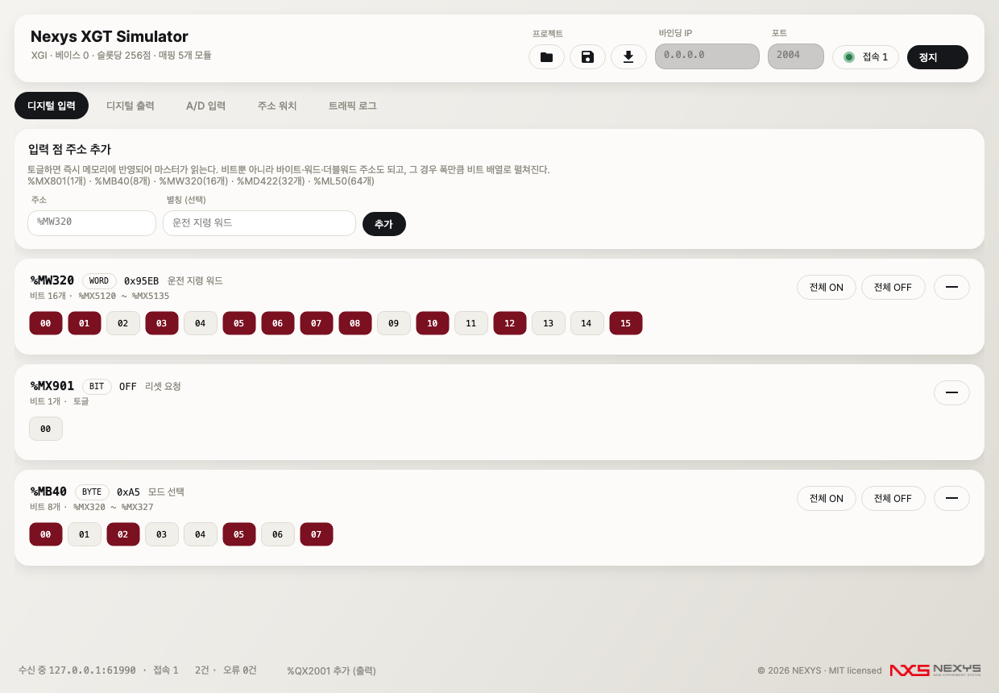
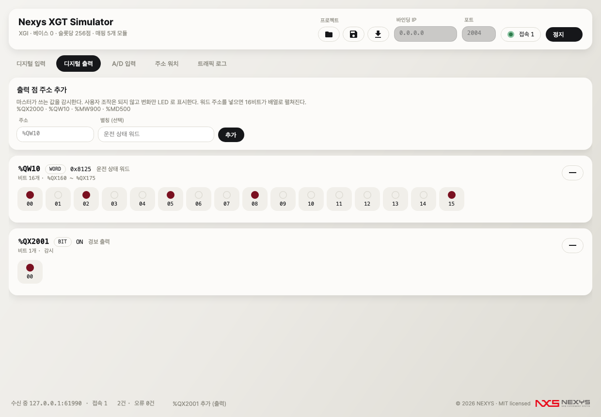
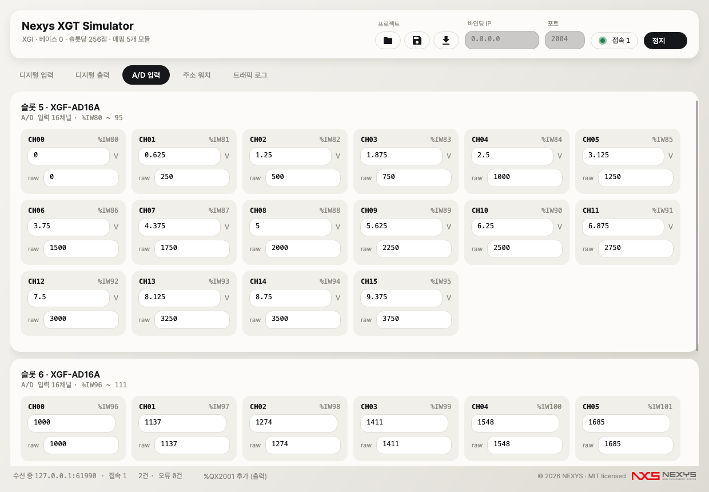
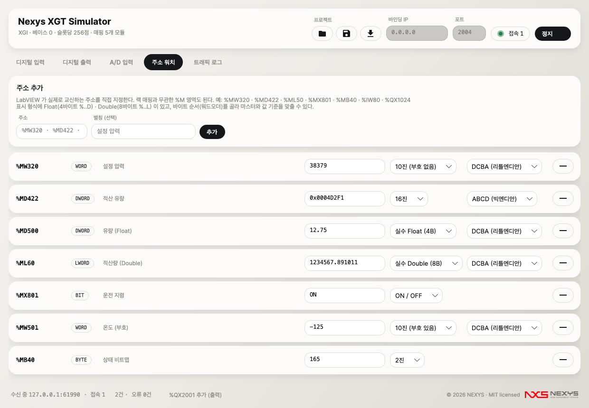
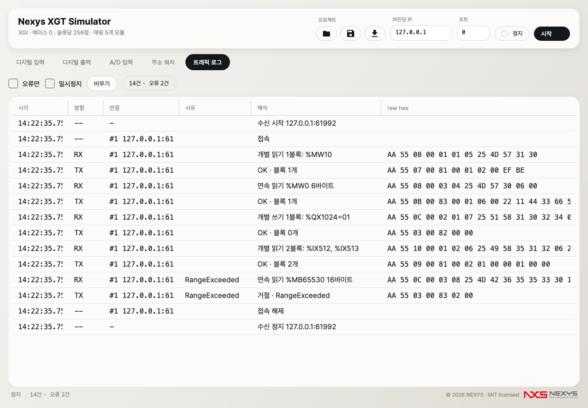

# Nexys XGT Simulator (nxsim)

LS XGT PLC(XGI CPU) 시뮬레이터. 실장비 없이 **LabVIEW 애플리케이션을 검증**하기 위해 PLC 역할을 대신한다.
XG5000은 실장비 없이 시뮬레이션이 불가능하므로 그 공백을 메운다.

C# 12 / .NET 8 · Avalonia 11 · 테스트 410개 · 빌드 경고 0



---

## LabVIEW 현장 검증 완료

**실제 LabVIEW 애플리케이션과의 접속·읽기·쓰기가 확인되었다** (2026-07-30).
XGT FEnet 코덱(TCP 2004)이 개별/연속 읽기·쓰기와 에러 응답까지 왕복한다.

> **남은 미확인 항목 1개** — `spec/xgt-fenet-reference.md` §5 **에러 상태 코드 표**.
> 정상 경로가 아니라 *거절 응답의 코드 값*이라 현장 검증으로는 확인되지 않는다.
> 매뉴얼 대조가 필요하며, 그 전까지는 `XgtFenetOptions.ErrorCodeMap` 으로 재컴파일 없이 교정할 수 있다.

코덱은 처음부터 불확실성을 흡수하도록 설계했다:

| 원칙 | 이유 |
|---|---|
| 신뢰도 낮은 헤더 필드(CPU Info·Position)는 **요청 값을 에코** | 정답을 몰라도 실장비처럼 답할 수 있다 — 맞혀야 하는 값의 수를 줄인다 |
| 수신 BCC 는 **기본 검사 안 함** | 계산 범위가 미확정이라, 틀린 범위로 검사하면 정상 요청을 전부 거절해 "접속 불가"로 보인다 |
| 에러 코드·쓰기 배치·한계값은 **설정으로 노출** | 재컴파일 없이 실장비와 맞춘다 (`XgtFenetOptions`) |
| 해석 실패는 예외가 아니라 **에러 응답** | 연결을 유지해 트래픽 로그로 계속 진단할 수 있다 |

### 프레임 자동 캡처 — 접속만 하면 근거가 모인다

**시뮬레이터는 수신한 프레임을 `fixtures/labview-capture/` 에 자동 캡처한다.**
LabVIEW 를 한 번 붙이는 것만으로 검증 자료가 쌓인다 — 별도 `nc` 캡처 절차가 필요 없다.

1. 시뮬레이터를 켜고 LabVIEW 를 붙인다
2. `fixtures/labview-capture/req_00_*.bin` 과 `.txt`(hex 해설)가 생긴다
3. 남은 항목(**에러 코드 표**)을 매뉴얼과 대조해 `spec` §5 잠정값을 교체한다

> ⚠️ 자동 캡처는 시뮬레이터 응답을 `.actual` 로 저장한다. **`.expected` 로 복사하지 말 것** —
> 회귀가 자기 자신을 검증하는 셈이 되어 아무것도 잡지 못한다. `.expected` 는 매뉴얼 대조 확정본만 넣는다.

---

## 설치와 실행

### Windows — 실행 파일 다운로드

[**릴리즈 페이지에서 `Nxs.App.exe` 받기**](../../releases) — 맨 위가 최신이다

단일 파일 self-contained 빌드다(약 97 MB). **.NET 런타임 설치가 필요 없다.** 받아서 더블클릭하면 된다.

- SmartScreen 경고가 뜨면 `추가 정보` → `실행` (코드 서명 인증서 없음)
- 릴리즈 페이지의 `SHA256SUMS.txt` 로 무결성을 확인할 수 있다
- ⚠️ 현재 빌드는 **macOS 에서 크로스 컴파일**되었고 Windows 실제 기동은 검증되지 않았다.
  첫 실행 시 [`SMOKE_CHECKLIST.md`](SMOKE_CHECKLIST.md) 0~2장으로 확인해 주기 바란다

### 소스에서 실행 (Windows / macOS / Linux)

```bash
dotnet run --project src/Nxs.App
```

---

## 사용법 체크리스트

### 처음 켤 때 (5분)

- [ ] `Nxs.App.exe` 실행 — 설치 과정 없이 창이 뜬다
- [ ] **"디지털 입력"** 탭에 주소를 추가해 토글해 본다 (`%MW320` 을 넣으면 16비트가 펼쳐진다)
- [ ] **"A/D 입력"** 탭 채널에 값을 넣어 raw 변환이 맞는지 확인한다
- [ ] **"주소 워치"** 탭에 LabVIEW 가 실제로 읽고 쓰는 주소를 추가한다 (예: `%MW320`, `%MD422`, `%ML60`)
      → 실수 값이면 형식을 `Float`/`Double` 로, 값이 뒤집혀 보이면 **바이트 순서**를 바꿔 맞춘다
- [ ] **"디지털 입력/출력"** 탭에 마스터가 쓰는 비트 주소를 추가한다 (예: `%MX900`, `%QX2000`)

### LabVIEW를 붙일 때

- [ ] **바인딩 IP** 를 정한다 — 다른 PC에서 접속하려면 `0.0.0.0`
      (⚠️ `127.0.0.1` 로 두면 다른 PC에서 접속 불가 — 접속 실패의 가장 흔한 원인)
- [ ] **포트** 를 실장비와 동일하게 맞춘다
- [ ] Windows 방화벽에서 해당 포트 인바운드 허용
- [ ] **[시작]** → 표시등이 회색(`대기 중`)으로 바뀌고 하단에 `수신 중 <IP:포트>` 가 보인다
- [ ] LabVIEW에서 연결 → 접속 수가 **1** 로 증가, "트래픽 로그"에 RX 행이 뜬다
- [ ] 입력 점 토글 → LabVIEW 화면에 반영되는지 확인 (**읽기** 경로)
- [ ] LabVIEW에서 출력 ON → "디지털 출력" LED가 켜지는지 확인 (**쓰기** 경로)
- [ ] **접속 표시등에 초록불**이 들어오는지 확인 (`● 접속 1`) — 통신이 붙었다는 신호
- [ ] "주소 워치" 탭에서 LabVIEW 가 쓰는 값이 실시간으로 바뀌는지 확인 (**티키타카 확인의 핵심**)
- [ ] 범위 밖 주소를 읽어 오류 응답을 받고도 **연결이 유지되는지** 확인
- [ ] `fixtures/labview-capture/` 에 자동 캡처 파일이 생겼는지 확인 → spec 검증에 쓴다

전체 절차와 증상별 원인 표는 **[`LABVIEW_CHECKLIST.md`](LABVIEW_CHECKLIST.md)** 에 있다.
배포 전 스모크 항목은 **[`SMOKE_CHECKLIST.md`](SMOKE_CHECKLIST.md)**.

### 매일 쓸 때

- [ ] **[📂]** 프로젝트 열기 → 저장해 둔 랙 구성·초기값·자동화 룰 복원
- [ ] **[💾]** 프로젝트 저장 → 현재 토글 상태와 AD 값이 초기값으로 저장된다
- [ ] **[⬇]** 트래픽 로그 저장 → 검증 근거를 파일로 남긴다
- [ ] 트래픽이 많으면 "오류만" 체크로 거절 사례만 본다

---

## 화면

### 디지털 입력·출력 — 주소를 직접 지정하고 비트 배열로 펼친다

고정된 랙 슬롯이 아니라 **원하는 주소를 직접 추가**한다. 비트뿐 아니라 **바이트·워드·더블워드·롱워드**도
되고, 그 경우 폭만큼 **비트 배열로 펼쳐진다**:

| 주소 | 펼쳐지는 비트 수 |
|---|---|
| `%MX801` | 1개 |
| `%MB40` | 8개 |
| `%MW320` | **16개** (가로 한 줄) |
| `%MD422` | 32개 |
| `%ML50` | 64개 |

- **입력 탭** — 각 비트를 토글 → 마스터가 읽어 확인. `전체 ON`/`전체 OFF` 로 한 번에도 가능
- **출력 탭** — 마스터가 쓴 값을 비트별 LED 로 표시 (조작 불가)
- 양쪽 모두 외부 변경을 표시에 반영 → **불리언 ON/OFF 를 양방향으로 검증**
- 그룹 헤더에 현재 값이 16진으로 함께 표시된다


`%MW320 = 0x95EB` 이면 켜진 비트가 정확히 `1001 0101 1110 1011` 배치로 보인다.



### A/D 입력 — 공학단위 ↔ raw 자동 변환

한쪽에 입력하면 반대쪽이 채널 스케일에 따라 자동 변환된다 (아래는 0–10 V ↔ raw 0–4000).



### 주소 워치 — LabVIEW 가 교신하는 임의 주소를 직접 지정

랙 매핑과 무관한 `%M` 영역도 된다. 주소를 넣고 별칭을 붙이면 값을 실시간으로 보고 직접 쓸 수 있다.

**표시 형식 7종** — 10진(부호 없음/있음) · 16진 · 2진 · ON/OFF · **실수 Float(4바이트)** · **실수 Double(8바이트)**
**바이트 순서 4종** — `DCBA(리틀엔디안)` · `ABCD(빅엔디안)` · `BADC(바이트 스왑)` · `CDAB(워드 스왑)`

형식과 바이트 순서를 **항목마다 따로** 정할 수 있어 값 기준을 LabVIEW 와 맞출 수 있다.
입력도 `4660` · `0x1234` · `-125` · `3.14159` · `ON` 을 모두 받는다. 목록은 `.nxp` 에 저장된다.



### 트래픽 로그 — raw hex + 해석 요약

RX/TX 쌍, 거절 사유, 타임스탬프가 함께 남는다. 오류 행만 필터할 수 있다.

> 아래 화면은 **테스트 하네스의 합성 코덱**으로 실제 왕복을 발생시켜 찍은 것이다.
> 표시된 hex 는 그 합성 포맷이며 **XGT 프레임이 아니다** — 로그 렌더링·해석 요약·오류 표시가
> 어떻게 보이는지를 나타낸다. 실제 XGT 세션에서는 `4C 53 49 53 2D 58 47 54`(LSIS-XGT)로 시작하는
> 프레임이 표시된다.



---

## 대상 랙 구성

`CONTEXT.md` 기재 구성(XG5000 I/O 파라미터 기준).

| 슬롯 | 모듈 | 할당 주소 |
|---|---|---|
| 0 | XGL-EFMT(B) FEnet | (프로세스 데이터 없음) |
| 1 | XGL-C42A Cnet | (프로세스 데이터 없음) |
| 2 | XGI-D24A DC입력 32점 | `%IX512` ~ `%IX543` |
| 3 | XGI-D24A DC입력 32점 | `%IX768` ~ `%IX799` |
| 4 | XGQ-TR4A TR출력 32점 | `%QX1024` ~ `%QX1055` |
| 5 | XGF-AD16A A/D 16채널 | `%IW80` ~ `%IW95` |
| 6 | XGF-AD16A A/D 16채널 | `%IW96` ~ `%IW111` |

> **⚠️ 이 주소는 슬롯당 256점(16워드) 스트라이드 가정에서 나온 값이다.**
> `spec/xgi-addressing.md` 가 비어 있어 실제 XGI 슬롯 할당 규칙이 확정되지 않았다.
> XGF-AD16A는 16워드(256비트)를 쓰므로 기본 가정 64점에는 담기지 않아 256점을 택했다.
> 매뉴얼로 확정되면 `IoConfiguration.CreateDefaultRack()` 의 `SlotPoints` 상수 **하나만** 바꾸면 된다
> (주소 산식 자체는 변경 불필요). **반드시 XG5000 I/O 파라미터와 대조하고 쓸 것.**

---

## 프로젝트 파일 (.nxp)

사람이 열어 고칠 수 있는 JSON이다.

```json
{
  "formatVersion": 1,
  "io": {
    "addressing": { "slotPoints": 256, "slotsPerBase": 12 },
    "bases": [ { "baseNumber": 0, "slots": [
      { "slotNumber": 2, "module": {
          "productName": "XGI-D24A", "kind": "DigitalInput", "pointCount": 32 } } ] } ]
  },
  "server": { "bindAddress": "0.0.0.0", "port": 2004 },
  "initialValues": [ { "address": "%MW100", "value": 4660 } ],
  "analogChannels": [
    { "slotNumber": 5, "channel": 0,
      "scale": { "rawMin": 0, "rawMax": 4000,
                 "engineeringMin": 0, "engineeringMax": 10, "unit": "V" } }
  ],
  "automationRules": [
    { "address": "%IW80", "kind": "Sine", "min": 0, "max": 4000,
      "period": 60, "periodMs": 100 }
  ],
  "watches": [
    { "address": "%MW320", "label": "설정 압력", "format": "Decimal", "order": "Dcba" },
    { "address": "%MD500", "label": "유량", "format": "Float", "order": "Abcd" },
    { "address": "%ML60", "label": "적산량", "format": "Double", "order": "Dcba" },
    { "address": "%MX801", "label": "운전 지령", "format": "Bool" }
  ],
  "digitalPoints": [
    { "address": "%MX900", "label": "운전 지령", "mode": "Input" },
    { "address": "%QX2000", "label": "운전 상태", "mode": "Output" }
  ]
}
```

### 주소 워치 (`watches`)

LabVIEW 가 교신하는 임의 주소를 지정한다.

- `format` — `Decimal` / `Signed` / `Hex` / `Binary` / `Bool` / `Float` / `Double`
- `order` — `Dcba`(리틀엔디안, 기본) / `Abcd`(빅엔디안) / `Badc`(바이트 스왑) / `Cdab`(워드 스왑)

`Float` 은 4바이트 주소(`%..D`), `Double` 은 8바이트 주소(`%..L`)가 필요하다.
UI 의 "주소 워치" 탭에서 추가·제거해도 되고, 이 절을 직접 편집해도 된다.

### 사용자 지정 디지털 점 (`digitalPoints`)

임의 비트 주소를 토글하거나 감시한다. `mode` 는 `Input`(사용자 토글) 또는 `Output`(LED 감시).
비트 주소(`%..X`)만 쓸 수 있다.

### 자동화 제너레이터

| `kind` | 파라미터 | 동작 |
|---|---|---|
| `Fixed` | `min` | 항상 같은 값 |
| `Increment` | `min` `max` `step` | step씩 증가, 범위를 감싼다 |
| `Ramp` | `min` `max` `step` | max를 정확히 찍고 min으로 복귀 |
| `Sine` | `min` `max` `period` | period tick마다 한 주기 (중앙값에서 시작) |
| `Random` | `min` `max` `seed` | 시드 고정 → **재현 가능** (tick의 순수 함수) |
| `Toggle` | — | 짝수 tick 참, 홀수 tick 거짓 |

`useEngineeringUnits: true` 이고 대상이 AD 채널 주소면 **그 채널의 스케일을 자동으로 공유**한다.
채널이 아닌 주소면 스케일 없이 raw로 동작한다.

> **팁** — 제너레이터 값은 정수다. 공학단위 룰의 범위가 좁으면(예: `0~10 V`) 값이 11단계로 양자화되어
> 계단처럼 움직인다. 매끄러운 파형이 필요하면 **raw 범위로 룰을 정의**하라(`min: 0, max: 4000`,
> `useEngineeringUnits` 생략). 표시는 스케일에 따라 공학단위로 환산되어 보인다.

---

## 개발

```bash
dotnet build                      # 경고 0 / 에러 0 이어야 한다
dotnet test                       # 전체 410개
dotnet run --project tools/Nxs.DocShots -- docs/screenshots   # README 스크린샷 재생성
```

### 구조

```
src/Nxs.Core/          UI 의존성 0
  Memory/              메모리맵 + IEC 주소 파서
  Protocol/            프레이밍 상태머신 · 요청 실행기 · 코덱 인터페이스
  Protocol/Xgt/        XGT FEnet 코덱 (⚠️ 미검증 초안)
  Server/              멀티클라이언트 TCP 서버 (프로토콜 무지)
  Configuration/       I/O 구성 · 모듈 카탈로그 · .nxp
  Automation/          제너레이터 · 룰 엔진
  Diagnostics/         트래픽 로그
  Fixtures/            캡처 재생 하네스 · 프레임 자동 캡처
  Time/                ITimeSource
src/Nxs.App/           Avalonia UI
tools/Nxs.DocShots/    README 스크린샷 생성기 (헤드리스 Skia)
tests/Nxs.TestKit/     합성 코덱 · 테스트 클라이언트 · FakeTimeSource
tests/                 Nxs.Core.Tests · Nxs.Integration.Tests · Nxs.App.Tests
spec/                  프로토콜 근거 (사람이 채운다 — 이 킷의 최중요 입력)
fixtures/labview-capture/   캡처 픽스처 (있으면 회귀 자동 편입)
```

### 설계 규율

- **프레임 세부는 spec 근거가 있는 것만 구현한다.** 근거 없으면 구현하지 않고 그 사실을 기록·표시한다
- 프레임 파서는 부분 수신 불변 — 1바이트씩 주입해도 같은 결과 (모든 분할점 테스트)
- 시간 로직은 `ITimeSource` 주입 — 타임스탬프·주기를 테스트가 결정적으로 다룬다
- 제너레이터는 tick의 순수 함수 — 상태가 없어 임의 순서 호출에도 같은 값
- `DESIGN.md` 골든 벡터는 수정·삭제하지 않는다
- 비주얼은 [`nexys-modbus-workbench`](https://github.com/Kim-Hakseong/nexys-modbus-workbench) 의
  `App.axaml` 을 그대로 이식 — 새 스타일·새 색 도입 금지 (리소스 값 대조 테스트로 고정)

빌드 이력과 모든 설계 결정의 근거는 **[`RALPH_LOG.md`](RALPH_LOG.md)** 에 있다.

---

## 상태 요약

| 기능 | 상태 |
|---|---|
| PLC 메모리맵 (%I/%Q/%M · X/B/W/D · 리틀엔디안 · 스레드 안전) | ✅ |
| IEC 주소 파서 (`%MW100`, `%MD422`, `%ML50`, `%MX801`, `%IX0.2.5`) | ✅ |
| I/O 구성 모델 → 메모리 자동 매핑 | ✅ |
| TCP 서버 (멀티클라이언트 · 부분 수신 불변 · 연결 격리) | ✅ |
| 요청 실행기 (개별/연속 읽기·쓰기 + 정확한 거절) | ✅ |
| I/O 패널 UI (입력 토글 · 출력 LED · AD 채널) | ✅ |
| 값 자동화 (고정/증가/램프/사인/랜덤/토글) | ✅ 코어만 (`.nxp` 정의 · UI 탭 없음) |
| 트래픽 로그 (RX/TX hex + 해석 + 오류 필터 + 파일 저장) | ✅ |
| 프로젝트 파일 (.nxp JSON) | ✅ |
| 주소 워치 (임의 주소 · 형식 7종 · 바이트 순서 4종) | ✅ |
| 사용자 지정 디지털 점 (임의 폭 · 비트 배열 · 양방향) | ✅ |
| **XGT FEnet 코덱 (TCP 2004)** | ✅ LabVIEW 현장 검증 완료 (에러 코드 표만 미확인) |
| 프레임 자동 캡처 (검증 근거 수집) | ✅ |
| **Cnet 서버 (P1)** | ⛔ spec 근거 부재 |
